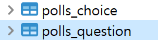
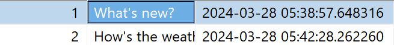

# 초기설정
- 가상환경 만들어서 새로 시작하기
- conda create -n dj python=3.10
- pip install django

## Django 시작
- git repository 만들어서 git clone -> 만들어진 곳 디렉토리로 들어가서 -> django-admin startproject mysite

- 결과
``` 
manage.py
mysite/
    __init__.py
    settings.py
    urls.py
    asgi.py
    wsgi.py
```

## 개발서버 
```
python manage.py runserver
```

# 앱 생성하기
- polls앱 생성하기
```
python manage.py startapp polls
```
- 결과 파일

디렉토리에 polls가 생성된다
```
polls/
    migrations/
        __init__.py
    __init__.py
    admin.py
    apps.py
    models.py
    tests.py
    views.py
```

## 라우팅 
- view 작성

“polls/view.py” 파일에 다음과 같은 코드 입력
```
from django.http import HttpResponse


def index(request):
    return HttpResponse("Hello, world. You're at the polls index.")
def cafe_menu(request):
    return HttpResponse("메뉴가 많아요")
def cafe_review(request):
    return HttpResponse("맛있게 드셨나요! 후기 부탁드려요")
def cafe_waiting(request):
    return HttpResponse("잠시만 기다려주세요 금방 드릴게요")
```

- view 호출하기

뷰를 호출하려면 URL과 연결하여야 한다 -> URLconf가 사용

polls 디렉토리에서 URLconf를 생성하려면 ``urls.py``라는 파일을 생성해야 합니다.

- polls/urls.py생성 

*** mysite/urls.py***와 다르다!!!

polls/urls.py에 다음과 같은 코드 작성
```
# polls 폴더에 urls.py가 없어서 새로 생성
from django.urls import path

from . import views

# 아무것도 없는 주소로 들어가면 views.py에 index함수에 연결
urlpatterns = [
    path("", views.index, name="index"),   # polls의 주소값이 아무것도 없다면 views.index호출해랴 : http://localhost:8000/polls/
    path("menu", views.cafe_menu, name="etc.."), # http://localhost:8000/polls/menu 라면 views.cafe_menu호출
    path("waiting", views.cafe_waiting, name="cafe_waiting"),
    path("review", views.cafe_review, name="cafe_review"),
]
```

- view를 URLconf에 연결

최상위 URLconf 에서 polls.urls 모듈을 바라보게 설정 

mysite/urls.py 파일을 열고, django.urls.include를 import 하고, urlpatterns 리스트에 include() 함수를 다음과 같이 추가

mysite/urls.py에 다음과 같이 입력
 ```
from django.contrib import admin
from django.urls import include, path


urlpatterns = [
    path("polls/", include("polls.urls")),
    path('admin/', admin.site.urls),
]
 ```
 include() 함수는 다른 URLconf들을 참조할 수 있도록 도와줍니다. Django가 함수 include()를 만나게 되면, URL의 그 시점까지 일치하는 부분을 잘라내고, 남은 문자열 부분을 후속 처리를 위해 include 된 URLconf로 전달합니다.
 - 언제 include()를 사용해야 하나요?

다른 URL 패턴을 포함할 때마다 항상 include()를 사용해야 합니다. admin.site.urls가 유일한 예외입니다.

# 데이터베이스

## SQLite database 세팅
- python manage.py migrate -> 자동으로 테이블 생성
- DBeaver -> DB 추가 -> db.sqlite -> 내용 확인

## 테이블 생성
- polls 앱에 models.py 내용을 입력
- settings.py에 app 등록
- python manage.py makemigrations polls -> 설계도 작성
- python manage.py migrate -> table 생성
- 생성된 내용 살펴보기

### polls 앱에 models.py 내용을 입력
```
# polls/models.py
from django.db import models


class Question(models.Model):
    question_text = models.CharField(max_length=200)
    pub_date = models.DateTimeField("date published")


class Choice(models.Model):
    question = models.ForeignKey(Question, on_delete=models.CASCADE)
    choice_text = models.CharField(max_length=200)
    votes = models.IntegerField(default=0)
```

### settings.py에 app 등록
```
'polls.apps.PollsConfig'

#결과
INSTALLED_APPS = [
    'django.contrib.admin',
    'django.contrib.auth',
    'django.contrib.contenttypes',
    'django.contrib.sessions',
    'django.contrib.messages',
    'django.contrib.staticfiles',
    'polls.apps.PollsConfig',  # settings.py에 app 등록
]
```

### python manage.py makemigrations polls -> 설계도 작성

터미널에 다음과 같이 작성
```
python manage.py makemigrations polls
```

- 결과 (polls/migrations/0001_initial.py)이 생성되고 0001_initial.py에 설계도가 생성됨
```
polls/
    migrations/
        __init__.py
        0001_initial.py
```
```
# 0001_initial.py
import django.db.models.deletion
from django.db import migrations, models


class Migration(migrations.Migration):

    initial = True

    dependencies = [
    ]

    operations = [
        migrations.CreateModel(
            name='Question',
            fields=[
                ('id', models.BigAutoField(auto_created=True, primary_key=True, serialize=False, verbose_name='ID')),
                ('question_text', models.CharField(max_length=200)),
                ('pub_date', models.DateTimeField(verbose_name='date published')),
            ],
        ),
        migrations.CreateModel(
            name='Choice',
            fields=[
                ('id', models.BigAutoField(auto_created=True, primary_key=True, serialize=False, verbose_name='ID')),
                ('choice_text', models.CharField(max_length=200)),
                ('votes', models.IntegerField(default=0)),
                ('question', models.ForeignKey(on_delete=django.db.models.deletion.CASCADE, to='polls.question')),
            ],
        ),
    ]

```

### python manage.py migrate -> table 생성

터미널에 다음과 같이 입력하면 table이 생성된다.
```
python manage.py migrate
```


다음과 같이 생성된 것을 볼 수 있다

## 테이블에 데이터 넣기
### shell열기
```
python manage.py shell
```

### 값 넣기(create) !!! 꼭 save()를 해줘야 데이터 베이스에 반영이된다.
```
# 예시
>>> from polls.models import Choice, Question
>>> Question.objects.all()   # 다 선택하기
<QuerySet []>
>>> from django.utils import timezone  # timezone import
>>> q = Question(question_text="What's new?", pub_date=timezone.now())  # 데이터 넣기
>>> q
<Question: Question object (None)>
>>> q.save()
>>> q.id
1
>>> q = Question(question_text="How's the weather?", pub_date=timezone.n
ow())
>>> q.save()
>>> q.id
2
```
결과



### read
```
>>> Question.objects.all()
<QuerySet [<Question: Question object (1)>, <Question: Question object (2)>]>
>>> q.question_text
"How's the weather?"
>>> q.pub_date
datetime.datetime(2024, 3, 28, 5, 43, 54, 75846, tzinfo=datetime.timezone.utc)
# get, filter 사용하기
사용법 get은 하나만 filter는 여러개 검색가능
>>> Question.objects.filter(id=1)
>>> Question.objects.get(id=1)
```

- question_text이 What 으로 시작하는거 찾아줘
```
>>> Question.objects.filter(question_text__startwith="What") 
```

- 현재년도와 같은거 찾아줘
```
>>> current_year = timezone.now().year
>>> current_year
2024
>>> Question.objects.filter(pub_date__year = current_year)
```

### update
```
#save()를 꼭 해줘야 한다!!! 그래야 데이터베이스에 반영이 됨
>>> q.question_text
"What's your favorite singer?"
>>> q.question_text = "Likelion"
>>> q.question_text
'Likelion'
>>> q.save()
```

## 매직매소드
Question.objects를 호출할때 <QuerySet [<Question: Question object (1)>]> 이렇게 호출되는 걸 

매직매소드를 통해 바꿔보도록 예쁘게 호출되도록 해봅시당

polls/models.py에 들어가서 
```
class Question(models.Model):
    question_text = models.CharField(max_length=200)
    pub_date = models.DateTimeField("date published")
    
    # 매직매소드
    def __str__(self):
        return self.question_text
    def was_published_recently(self):
        return self.pub_date >=timezone.now() - datetime.timedelta(days=1)
    def length_question_text(self):
        return len(self.question_text)


class Choice(models.Model):
    question = models.ForeignKey(Question, on_delete=models.CASCADE)
    choice_text = models.CharField(max_length=200)
    votes = models.IntegerField(default=0)
    
    def __str__(self):
        return self.choice_text
```

이렇게 매직매소드를 추가해주면 <QuerySet [<Question: Question object (1)>]> -> <QuerySet [<Question: What's new?>]>
```
>>> from polls.models import Choice, Question
>>> Question.objects.all()
<QuerySet [<Question: What's new?>, <Question: How's the weather?>]>
>>> Question.objects.filter(id=1)
<QuerySet [<Question: What's new?>]>

```

- 무언가 하나의 쿼리에서 받아오는 기능을 하는 매소드를 쓸때는 get을 써야한다!
``` 
>>> q = Question.objects.get(pk=1)
>>> q
<Question: What's new?_Question>
# 최근에 업데이트 됐는지 알아보는 기능
>>> q.was_published_recently()
True
# question_text의 길이를 받아오는 기능
>>> q.length_question_text()
11
```


# 상속
## 매서드 오버라이드
구조들이 이미 짜져있는 것 - 안의 내용을 맞춰 바꾸는 것?

# reverse() vs reverse_lazy
- Class 내부에서 변수로 url 반환 값을 선언하고자 할 때에는 reverse_lazy를 사용하고
- Class 함수 내부, 또는 함수 내부에서 url 값을 선언하고자 할 때에는 reverse를 사용한다

파이썬에서 클래스를 evaluate하는 순서와 관련이 있다.

클래스 변수를 선언하게 되면, 이는 클래스가 포함된 파일 또는 클래스를 import 할 때에도 evaluate 된다

이 때 이 url 관련 변수를 reverse를 통해 선언하게 되면, 쟝고가 실행되면서 코드를 evaluate할 때 해당 값을 setting

쟝고가 reverse, reverse_lazy등을 사용해 url 절대 경로를 찾을 때에는 settings.py를 통해 초기화된 URLConf 설정값을 참고한다.

따라서 만약 import된 클래스 내부의 url 변수를 reverse로 찾는다면, 쟝고가 실행되기 위해 Python으로 작성된 코드를 evaluate 하는 과정에서 url을 찾는 작업을 하게 된다. 이 때는 settings.py가 초기화 되지 않은 상태이므로 url을 찾지 못하는 오류가 발생한다
참고: https://yuuraa.github.io/djange/reverse_lazy/python/django-reverse-lazy/